# Developer Guide

1. [Acknowledgements](#acknowledgements)
2. [Design](#design)
    - [Architecture](#Architecture)
    - [UI Component](#ui-component)
    - [Logic Component](#logic-component)
    - [Model Component](#model-component)
    - [Storage Component](#storage-component)
3. [Implementation](#implementation)
    - [Feature: Add](#add-feature)
    - [Feature: Update](#update-feature)
    - [Feature: Delete](#delete-feature)
    - [Feature: List](#list-feature)
    - [Feature: Find](#find-feature)
    - [Feature: Username](#username-feature)
    - [Feature: Dashboard](#dashboard-feature)
    - [Feature: Exit](#exit-feature)
    - [Feature: Storage](#storage-feature)
4. [Appendix: Requirements](#appendix-requirements)
   - [Product Scope](#product-scope)
   - [User Stories](#user-stories)
   - [Non-Functional Requirements](#non-functional-requirements)
   - [Glossary](#glossary)
5. [Appendix: Instructions for Manual Testing](#appendix-instructions-for-manual-testing)


## Acknowledgements
We would like to thank our TA Nigel Yeo, Prof Akshay and the CS2113 Team for their guidance.

## Design

### Architecture
The Internity application adopts layered architecture where responsibilities are divided among UI, Logic, Model and Storage related
components. It also follows the Command Pattern for handling user actions. This design separates concerns
clearly, allowing for modular, maintainable and extensible code.

The **Architecture Diagram** below explains the high-level design of the Internity application.\
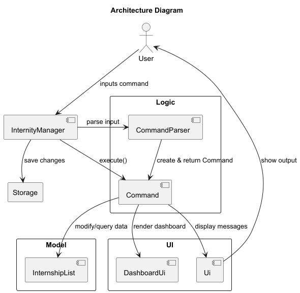<br>

The diagram below shows a simplified **Class Diagram** of all of Internity's classes and their relationships.


#### Layers
1. Controller
   - Classes: `InternityManager`
   - Responsibilities:
     - Launches and shuts down the application.
     - Receives input from the user and delegates parsing to the `Logic` layer.
     - Commands executed by `Logic` layer may modify the `Model` or trigger UI updates.
     - It also handles reading from and writing to the `Storage` layer.
     - Simplifies interactions between all layers and maintains a clear separation of concerns.
2. UI (User Interface)
    - Classes: `Ui`, `DashboardUi`
    - Responsibilities:
        - Handles all user-facing output (printing, dashboards, etc.).
        - Does not perform any logic or state changes.
        - Displays information passed from the `Logic` or `Model` layers in a user-friendly format.
        - Invoked by Commands to show feedback or results.
3. Logic
   - Classes: `CommandParser`, `CommandFactory`, `ArgumentParser`, `Command` subclasses
   - Responsibilities:
       - Acts as the intermediary between user input and `Model` operations.
       - Parses and validates user commands.
       - Constructs the appropriate `Command` object through the `CommandFactory`.
       - Executes commands, which modify the `Model` or trigger the `UI` to display information.
4. Model
   - Classes: `InternshipList`, `Internship`, `Date`, `Status`
   - Responsibilities:
     - Stores internship data
     - Provides operations like adding, deleting, updating, finding or listing internships.
     - Completely independent of UI and input logic.
5. Storage
   - Classes: `Storage`
   - Responsibilities:
     - Reads and writes internship data to persistent storage (e.g., file system). 
     - Keeps data consistent between sessions. 
     - Used by InternityManager to save or load application state.

#### User Interaction
The Sequence Diagram below shows a simplified version of how the components interact with each other when the user issues the command
`delete 1`.


---

### UI Component
#### Overview
The UI component is responsible for all interactions between the user and the application.
It displays messages, prompts, and formatted lists in the command-line interface (CLI), and ensures that feedback 
from executed commands is presented clearly.

The API of this component is specified in the [`Ui.java`](https://github.com/AY2526S1-CS2113-W14-4/tp/blob/master/src/main/java/internity/ui/Ui.java) class
and the [`DashboardUi.java`](https://github.com/AY2526S1-CS2113-W14-4/tp/blob/master/src/main/java/internity/ui/DashboardUi.java).

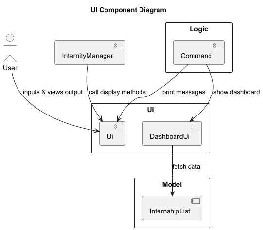

#### How it Works
1. The `InternityManager` handles all user input through a `Scanner`.
When a command is executed, it delegates output responsibilities to the `Ui` class.
2. The `Ui` component formats and prints the messages or internship data to the console.
For example:
   - `Ui.printAddInternship()` displays confirmation for a newly added internship.
   - `Ui.printFindInternship()` displays results in a neat, column-aligned format.
3. For specialized displays such as the dashboard, the `DashboardUi` class is used.

#### Design Considerations
- Static methods
  - The `Ui` class methods are static to ensure simplicity and easy access across commands without requiring
  instantiation.
- Loose coupling
  - The UI does not directly modify model or logic components. 
  - It only displays results based on data passed to it.

---

### Logic Component

#### Overview
The Logic component is responsible for:
- Parsing user input commands.
- Creating the appropriate `Command` object.
- Executing that command to modify the Model or interact with the UI.

#### Chosen Approach
This component follows the **Command Pattern**, which decouples the user input parsing from the execution of commands.
Each command is represented as a subclass of the abstract `Command` class, encapsulating its execution logic. This
allows new commands to be easily added without modifying the core parsing or execution workflow.

####  Class Diagram
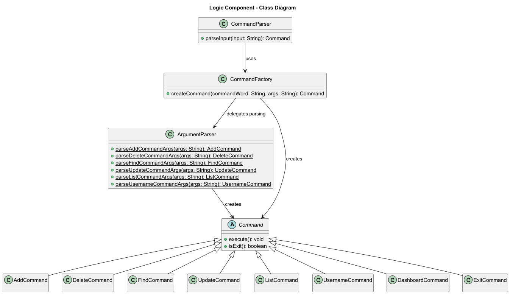

The class diagram above shows the main classes involved in parsing, creating, and executing commands.
- CommandParser is responsible for validating and splitting the input.
- CommandFactory creates the appropriate Command object.
- ArgumentParser is a static utility class used to parse arguments for commands that require them.
- All Command subclasses implement the execute() method, following the Command Pattern.

#### How it Works
1. User input (e.g. `add company/Google role/Software Engineer deadline/17-09-2025 pay/1000`) is received by CommandParser.
2. The `CommandParser`:
   - Validates that the input is not empty or malformed.
   - Splits the input into a command keyword and arguments.
   - Passes them into the `CommandFactory`.
3. The `CommandFactory`:
   - Matches the keyword to a corresponding `Command` subclass (e.g. `AddCommand`).
   - Uses the `ArgumentParser` to interpret argument strings.
   - Returns a fully constructed `Command` object.
4. The `Command` object executes its logic (e.g. adds a new internship to `InternshipList`).
5. Finally, the result of the execution is printed ot the console via the `Ui`.

#### Sequence Diagram
The following sequence diagram illustrates how the Logic Component processes an input command:

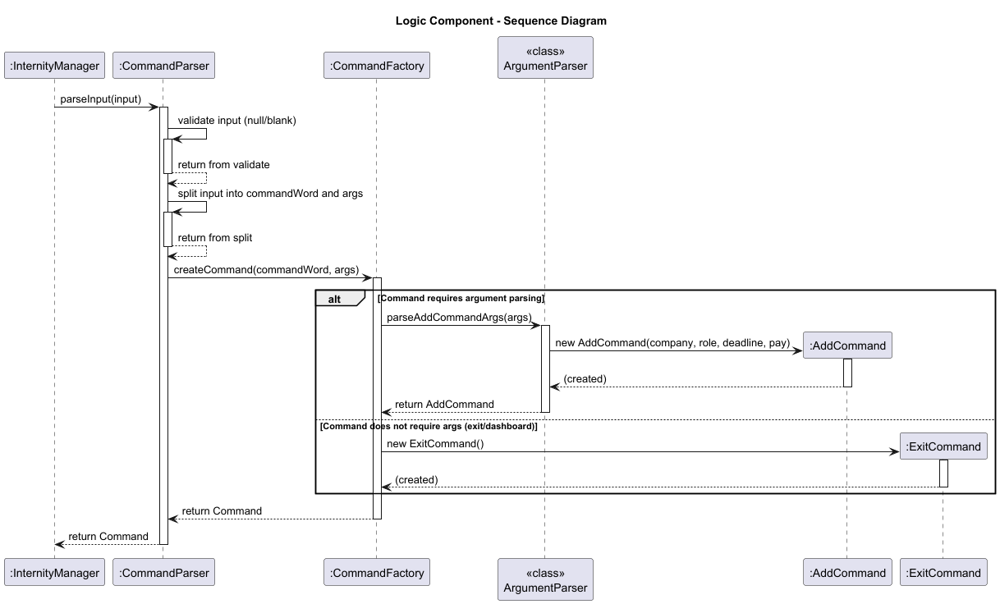

#### Explaining Commands with and without arguments
1. Commands that **require** arguments 
   - `add`, `update`, `delete`, `find`, `list`, `username`
   - These commands need extra information to execute correctly:
     - `add` needs company, role, deadline and pay.
     - `update` needs an index and fields to update.
     - `find` needs a search keyword.
2. Commands that **do not require** arguments
   - `exit`, `dashboard`, `help`
   - These commands operate independently of data supplied by the user.
   - `CommandFactory` directly constructs the corresponding `Command` object (e.g. `ExitCommand` or `DashboardCommand`) without invoking `ArgumentParser`.

This distinction is represented in the above sequence diagram's `alt` block, showing the two conditional flows:
- Top path (commands requiring arguments) -> parsed via `ArgumentParser`.
- Bottom path (commands not requiring arguments) -> instantiated directly.

---

### Model Component

**API**: [`internity.core`](https://github.com/AY2526S1-CS2113-W14-4/tp/blob/master/src/main/java/internity/core/) (exclude Storage.java)

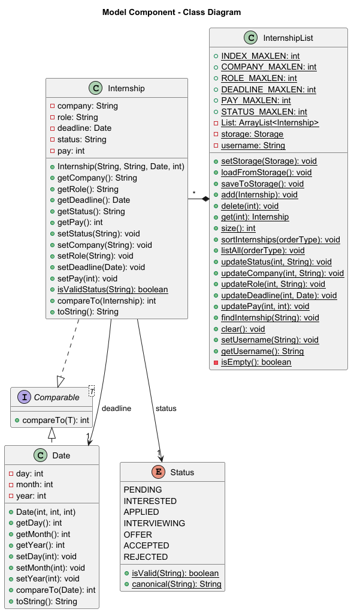

The `Model` component:
* stores internship data i.e. all `Internship` objects in an `InternshipList` object
* provides operations to manipulate that data e.g. `add`, `delete`, `update`, `find`, `list` internships
* does not depend on the other three components (i.e. `UI`, `Logic`, `Storage`)

The following sequence diagram illustrates how the Model Component processes an Add command:
*coming soon*

---

### Storage Component

**API**: [`Storage.java`](https://github.com/AY2526S1-CS2113-W14-4/tp/blob/master/src/main/java/internity/storage/Storage.java)

The `Storage` component:
* can save internship data in a pipe-delimited text format, and read it back into corresponding objects.
* depends on classes in the `internity.core` package (specifically `Internship` and `InternshipList`) to load and save internship data.
* automatically creates the data directory and file if they don't exist.
* handles corrupted data gracefully by skipping invalid entries and logging warnings instead of crashing the application.

The following class diagram shows the Storage component and its relationships:

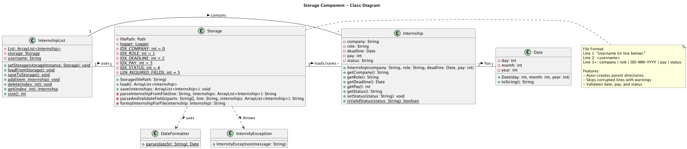

The class diagram illustrates:
* **Storage** manages file I/O operations and uses helper methods for parsing and formatting
* **InternshipList** acts as a facade, coordinating between Storage and the in-memory list
* **Internship** and **Date** are the data models that get serialized/deserialized
* **DateFormatter** provides date parsing utilities used during the load operation
* **InternityException** is thrown when storage operations encounter errors

---

## Implementation

### Add feature

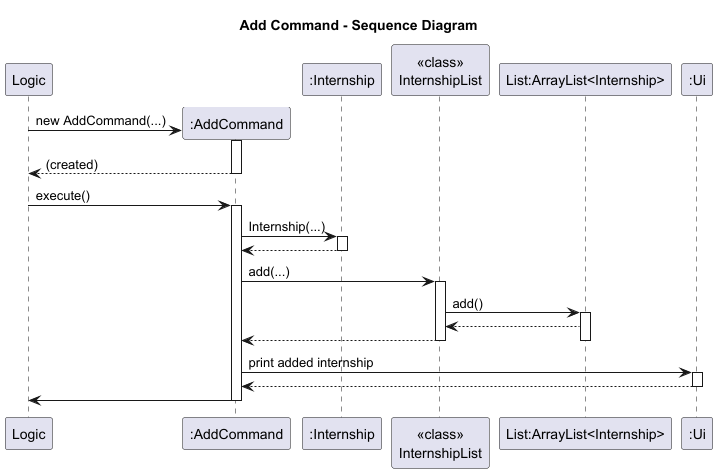

---

### Update feature

---

### Delete feature

**API**: [`DeleteCommand.java`](https://github.com/AY2526S1-CS2113-W14-4/tp/blob/master/src/main/java/internity/logic/commands/DeleteCommand.java)

The delete mechanism allows users to remove internship entries from their tracking list. This feature is essential for maintaining an up-to-date list of relevant internship applications by removing entries that are no longer needed.

#### Implementation

The delete mechanism is facilitated by `DeleteCommand`, which extends the abstract `Command` class. It stores an index field internally as a 0-based integer, although users interact with 1-based indices for a more natural experience.

**Key components involved:**

* `DeleteCommand` - Encapsulates the delete operation with validation and execution logic
* `ArgumentParser.parseDeleteCommandArgs()` - Converts user input to a 0-based index
* `InternshipList.delete()` - Removes the internship from the static list with bounds checking
* `InternshipList.get()` - Retrieves internship details before deletion for user feedback
* `Storage.save()` - Automatically persists changes after successful deletion

#### How the delete operation works

Given below is an example usage scenario and how the delete mechanism behaves at each step.

**Step 1.** The user launches the application and the `InternshipList` contains 3 internships. The user executes `delete 2` to delete the 2nd internship in the list.

**Step 2.** The `CommandParser` validates the input and splits it into command word `"delete"` and arguments `"2"`.

**Step 3.** The `CommandFactory` delegates to `ArgumentParser.parseDeleteCommandArgs("2")`, which:
* Parses `"2"` as an integer
* Converts the 1-based index (2) to 0-based index (1)
* Creates and returns a new `DeleteCommand(1)`

**Step 4.** `InternityManager` calls `DeleteCommand.execute()`, which:
* Calls `InternshipList.get(1)` to retrieve the internship details (for displaying to the user)
* Calls `InternshipList.delete(1)` to remove the internship from the list
  * This method validates that the index is within bounds before removal
* Calls `InternshipList.size()` to get the updated list size
* Calls `Ui.printRemoveInternship()` to display a confirmation message

**Step 5.** After the command completes, `InternityManager` automatically calls `InternshipList.saveToStorage()`, which in turn calls `Storage.save()` to persist the changes to disk.

The following sequence diagram illustrates the complete delete operation flow:

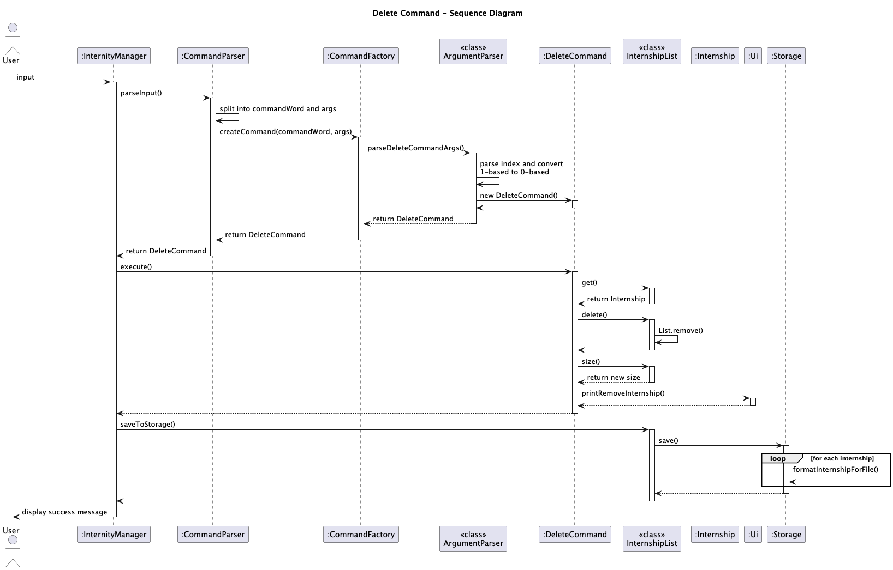

The sequence diagram shows how the delete command flows through multiple layers:
1. **Input Layer**: User input is received by `InternityManager`
2. **Parsing Layer**: `CommandParser` and `CommandFactory` work with `ArgumentParser` to create the command
3. **Execution Layer**: `DeleteCommand` interacts with `InternshipList` and `Ui`
4. **Persistence Layer**: Changes are automatically saved via `Storage`

---

### List feature

The list mechanism is implemented by the `ListCommand` class, which allows users to view all internships in their list.

Below is the sequence diagram for a common usage of the list feature:
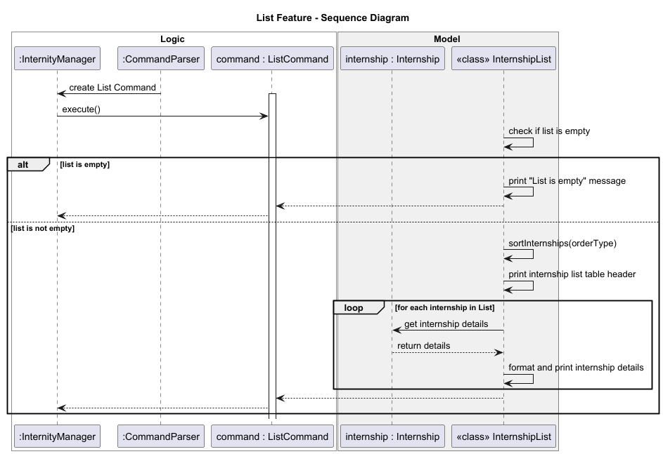

#### Design considerations

**Aspect: Index base convention**

* **Alternative 1 (current choice):** Users provide 1-based indices, converted to 0-based internally in `ArgumentParser`.
  * Pros: More intuitive for users who see numbered lists starting from 1 in the UI
  * Pros: Follows common conventions in user-facing applications
  * Cons: Requires conversion logic and careful management of the conversion point to avoid off-by-one errors
  * Cons: Developers must be careful to use the correct index type throughout the codebase

* **Alternative 2:** Use 0-based indices throughout, including in user-facing output.
  * Pros: Simpler implementation with no conversion needed
  * Pros: Consistent with Java's ArrayList indexing
  * Cons: Less intuitive for users unfamiliar with programming conventions
  * Cons: May lead to user confusion and errors when entering indices

**Aspect: When to retrieve internship details**

* **Alternative 1 (current choice):** Retrieve internship details before deletion.
  * Pros: Allows displaying specific internship information (company, role) in the success message
  * Pros: Better user experience with more informative feedback
  * Cons: Requires an additional `get()` call before deletion

* **Alternative 2:** Only validate index, delete, and show generic success message.
  * Pros: Simpler implementation with fewer method calls
  * Cons: Less informative user feedback
  * Cons: User cannot verify which internship was actually deleted

**Aspect: Index validation location**

* **Alternative 1 (current choice):** Perform bounds checking in `InternshipList.delete()` and `InternshipList.get()`.
  * Pros: Centralized validation logic in the model layer
  * Pros: Ensures all access to the list is safe, regardless of caller
  * Pros: Follows encapsulation principles
  * Cons: May result in duplicate checks if both `get()` and `delete()` are called

* **Alternative 2:** Validate index only in `ArgumentParser` before creating `DeleteCommand`.
  * Pros: Early validation could provide faster feedback
  * Cons: Violates encapsulation - the model layer should protect its own invariants

---

### Find feature

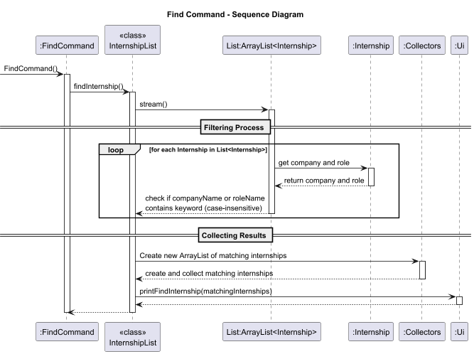

The find mechanism is implemented by the `FindCommand` class, which allows users to search for internships based on a
keyword that matches either the company name or the role of the internship.

The FindCommand class extends Command and consists of the following key components and operations:
* FindCommand.execute() - Executes the command by searching for internships that match the provided keyword.
The search looks for matching company or role names.

### Class and Method Breakdown

#### 1. `FindCommand` Constructor

- **Purpose**: Initialises a `FindCommand` object with a given keyword.
- **Signature**:
    ```java
    public FindCommand(String keyword);
    ```
- **Parameters**:
    - `keyword`: The keyword to search for in the company or role fields of the internships.

#### 2. `FindCommand.execute()`

- **Purpose**: Executes the find command, which triggers a search for internships matching the keyword.
- **Signature**:
    ```java
    @Override
    public void execute() throws InternityException;
    ```
- **Steps**:
    1. Logs the command execution start.
    2. Calls `InternshipList.findInternship(keyword)` to filter and search through the list of internships.
    3. Logs the success of the operation.

#### 3. `InternshipList.findInternship()`

- **Purpose**: Filters and returns internships whose company or role contains the given keyword, case-insensitively.
- **Signature**:
    ```java
    public static void findInternship(String keyword);
    ```
- **Parameters**:
    - `keyword`: The string to search for in the company or role names of internships.
- **Implementation**:
    - Internships are filtered using a stream to check if the keyword exists in either the company name or the role.
    - The filter is case-insensitive (`keyword.toLowerCase()`).
    - If no internships match the keyword, a message is printed: "No internships with this Company or Role found."
    - If matches are found, the results are passed to the `Ui.printFindInternship()` method for display.

### Example Usage Scenario

1. **Step 1**: The user launches the application and executes a find command by typing `find Google`.

2. **Step 2**: The `CommandParser` parses the input, extracting the command word `find` and the argument `Google`.

3. **Step 3**: The `CommandFactory` creates a `FindCommand` with the keyword `Google`.

4. **Step 4**: The `FindCommand.execute()` method is called, triggering the `InternshipList.findInternship()` method.

5. **Step 5**: `findInternship()` filters the internships, looking for the keyword in both the company and role fields.
If any matches are found, they are displayed through the UI.

6. **Step 6**: If no matches are found, the user sees the message printed in the Ui: "No internships with this Company or Role found."

### Internals and Key Functions

- **Keyword Matching**: The keyword is matched against both the company and role fields of each internship in a
case-insensitive manner using the `toLowerCase()` method.
  
- **Logging**: The command execution is logged at the start and end, using the `Logger` class to track the command’s
lifecycle.

- **UI Handling**: When matching internships are found, they are passed to the `Ui.printFindInternship()` method
for display. The UI is responsible for presenting the search results to the user.

### Example Interaction

- **User Input**:
    ```sh
    find Google
    ```

- **Expected Output**:
    ```
    These are the matching internships in your list:
      1.  Google - Software Engineer | Deadline: 10-12-2025 | Pay: 100000 | Status: Pending
      2.  Alphabet - Googler | Deadline: 10-12-2025 | Pay: 150000 | Status: Pending
    ```

  If no internships match:
    ```
    No internships with this Company or Role found.
    ```

### Edge Cases and Considerations

- **Case Insensitivity**: The search is case-insensitive, so `find google`, `find GOOGLE`, or `find GoOgLe`
would all match the same internships.

- **Empty or Invalid Keyword**: If an empty string is provided as the keyword, the Ui will print
"Invalid find command. Usage: find KEYWORD"

- **Performance**: The search mechanism uses a stream-based filter on the internship list, which is efficient
for moderate-sized datasets but may require optimisation for larger datasets.

### Persistence

Since this is a search command and does not modify the underlying data, no changes are persisted to disk
during the `find` operation. However, any modifications (such as deletion or addition of internships) will require a subsequent call to `Storage.save()` to persist the changes.

---

### Username feature

The Username feature allows the user to set a personalized username that is stored within the application's
persistent data model and displayed in future interactions.

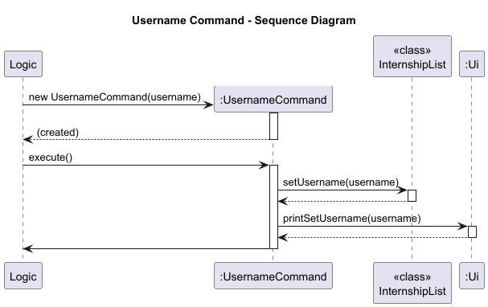


#### Implementation
1. The `UsernameCommand` is created by the `CommandParser` after recognizing the `username` keyword from user input.
    ```sh
    username Jane Doe
    ```
2. The `UsernameCommand` constructor validates that the argument is non-null and non-blank.
3. When `execute()` is called:
   - The provided username is stored via `InternshipList.setUSername(username)`.
   - The UI is updated through `Ui.printSetUsername(username)` to show the change.
4. The command does not modify any internship data and does not terminate the application.

#### Design Considerations
1. Single Responsibility: The command only handles username updates.
2. User feedback: `Ui.printSetUsername()` provides clear confirmation of a successful command execution.

---

### Dashboard feature

The Dashboard feature presents a comprehensive summary of the user's internship tracking data, including
the username, total internships, status overview and nearest deadline.

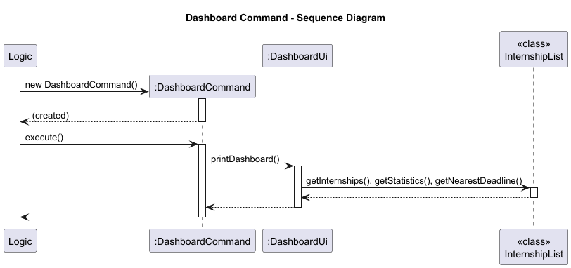

#### Implementation
1. The `DashboardCommand` serves as a simple trigger to call the UI layer.
      ```sh
      dashboard
      ```
2. The `DashboardUi` class handles all the logic for displaying information retrieved from `InternshipList`.
3. Inside `DashboardUi.printDashboard()`, the following occurs:
   - User display: Prints the current username using `InternshipList.getUsername()`.
   - Internship count: Fetches and displays total internships via `InternshipList.size()`.
   - Nearest deadline: Iterates through internships to find the one with the earliest `Date`.
   - Status overview: Aggregates internship statuses into categories (Pending, Applied, etc.) and displays a summary.
4. If no internships exist, a meaningful fallback message is shown (e.g. "No internships found.").

#### Design Considerations
1. Separation of concerns: `DashboardCommand` delegates all display logic to `DashboardUi`.
2. Read-only operation: The dashboard performs only data retrieval, ensuring no side effects.
3. Extensibility: The `DashboardUi` class can easily be expanded to include additional statistics in the future.

---

### Exit feature

The ExitCommand allows the user to gracefully terminate the Internity application. Upon execution, it ensures that the user is notified
and the main command loop in InternityManager is stopped.

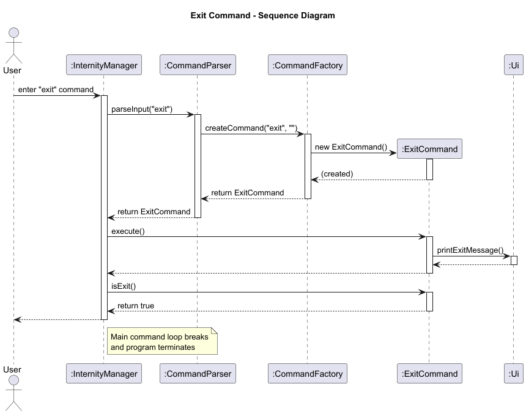

#### Implementation
1. When the user enters `exit`, the `CommandParser` returns an `ExitCommand` instance.
2. `InternityManager` calls `execute()` on the command, which triggers an interaction with the `Ui` class to display a friendly exit message before
termination.
3. Since `isExit()` returns true, the main loop breaks, ending the program.
4. ExitCommand is the only `Command` subclass that returns true for `isExit()`.

---

### Storage feature

**API**: [`Storage.java`](https://github.com/AY2526S1-CS2113-W14-4/tp/blob/master/src/main/java/internity/core/Storage.java)

The Storage feature provides persistent data storage for Internity, allowing users to save their internship data across application sessions. Without this feature, users would lose all their internship data when closing the application. This is a critical feature that transforms Internity from a temporary session-based tool to a reliable long-term tracking system.

#### Implementation

The Storage mechanism uses a human-readable, pipe-delimited text file format that can be easily inspected and manually edited if needed. The implementation is split between the `Storage` class (which handles file I/O) and `InternshipList` (which coordinates the loading and saving operations).

**Key components involved:**

* `Storage` - Handles all file I/O operations, parsing, validation, and formatting
* `InternshipList.loadFromStorage()` - Coordinates the loading process during application startup
* `InternshipList.saveToStorage()` - Coordinates the saving process after each command
* `InternityManager` - Calls load on startup and auto-saves after each command execution
* `DateFormatter` - Parses date strings during loading
* `InternityException` - Signals storage-related errors

**File format specification:**

```
Username (in line below):
<username>
<company> | <role> | <DD-MM-YYYY> | <pay> | <status>
<company> | <role> | <DD-MM-YYYY> | <pay> | <status>
...
```

**Example:**
```
Username (in line below):
John Doe
Google | Software Engineer | 15-12-2025 | 5000 | Pending
Meta | Data Analyst | 20-01-2026 | 4500 | Applied
Amazon | Backend Developer | 10-11-2025 | 6000 | Interview
```

#### How the storage operations work

##### Load Operation

The load operation occurs once during application startup, before the user sees the welcome message.

**Step 1.** `InternityManager.start()` calls `InternityManager.loadData()` which invokes `InternshipList.loadFromStorage()`.

**Step 2.** `InternshipList.loadFromStorage()` calls `Storage.load()`, which returns an `ArrayList<Internship>`.

**Step 3.** Inside `Storage.load()`:
* Check if the file exists. If not, return an empty list (first-time users).
* Open a `BufferedReader` to read the file line by line.
* Read and validate the first line (must be `"Username (in line below):"`).
* Read the second line as the username and call `InternshipList.setUsername()`.
* For each subsequent line:
  * Call `parseInternshipFromFile()` to parse the line.
  * Split the line by `"|"` delimiter and trim all parts.
  * Validate that there are exactly 5 fields.
  * Call `parseAndValidateFields()` to validate each field:
    * Company and role must not be empty.
    * Pay must be a valid non-negative integer.
    * Status must be a valid status value (Pending/Applied/Interview/Offer/Rejected).
    * Deadline must be in DD-MM-YYYY format and represent a valid date.
  * If validation passes, create an `Internship` object and add it to the list.
  * If validation fails, print a warning message to stderr and skip the line (graceful degradation).

**Step 4.** `Storage.load()` returns the ArrayList of successfully parsed internships.

**Step 5.** `InternshipList.loadFromStorage()` clears the static list and adds all loaded internships.

The following sequence diagram illustrates the load operation:

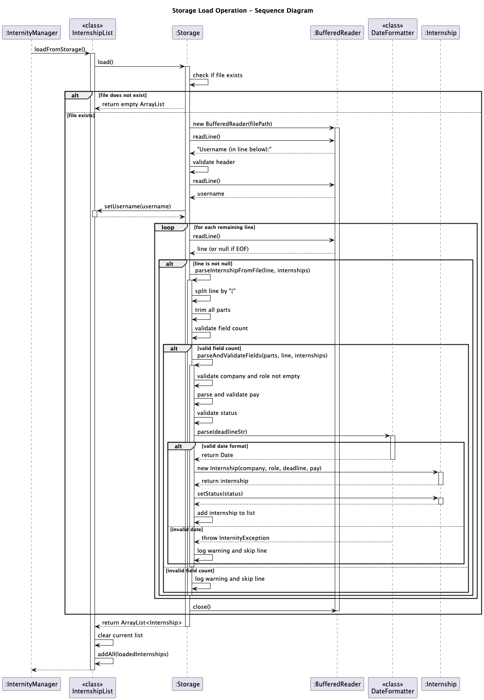

The load sequence diagram demonstrates the robust error-handling approach: corrupted lines are skipped with warnings rather than causing the entire load operation to fail. This design choice prioritizes availability over strict consistency, ensuring users can still access their valid data even if some entries are corrupted.

##### Save Operation

The save operation occurs automatically after every command that modifies data (add, delete, update, username).

**Step 1.** After a command completes execution, `InternityManager` calls `InternityManager.saveData()`, which invokes `InternshipList.saveToStorage()`.

**Step 2.** `InternshipList.saveToStorage()` calls `Storage.save(List)`, passing the static ArrayList.

**Step 3.** Inside `Storage.save()`:
* Check if the parent directory exists. If not, create it using `Files.createDirectories()`.
* Open a `PrintWriter` to write to the file (overwrites existing content).
* Write the username header (`"Username (in line below):"`).
* Retrieve and write the username via `InternshipList.getUsername()`.
* For each internship in the list:
  * Call `formatInternshipForFile()` to create the pipe-delimited string.
  * Retrieve company, role, deadline, pay, and status from the internship.
  * Format as: `"company | role | DD-MM-YYYY | pay | status"`.
  * Write the formatted line to the file.
* Close the `PrintWriter` to flush and finalize the file.

**Step 4.** If any `IOException` occurs, wrap it in an `InternityException` and throw it. `InternityManager` catches this and displays a warning (but doesn't crash the application).

The following sequence diagram illustrates the save operation:

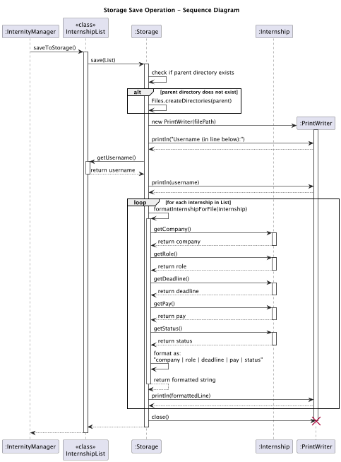

The save sequence diagram shows the straightforward serialization process. Note that the entire file is rewritten on each save operation, which is acceptable for the target use case (up to 1000 internships) but would require optimization for larger datasets.

#### Design considerations

**Aspect: File format choice**

* **Alternative 1 (current choice):** Pipe-delimited text format.
  * Pros: Human-readable, easy to debug and manually edit if needed.
  * Pros: Simple parsing logic without external dependencies.
  * Pros: Works across all platforms without binary compatibility issues.
  * Cons: Slightly larger file size compared to binary formats.
  * Cons: No built-in schema validation.
  * Cons: Performance degrades with very large files (not an issue for target use case of ~1000 entries).

* **Alternative 2:** JSON format using a library.
  * Pros: Structured format with built-in validation.
  * Pros: Easier to extend with new fields.
  * Pros: Better for complex nested data structures.
  * Cons: Less human-readable due to verbose syntax.
  * Cons: Overkill for simple tabular data.

* **Alternative 3:** Binary serialization using Java's `ObjectOutputStream`.
  * Pros: Compact file size.
  * Pros: Fast serialization/deserialization.
  * Cons: Not human-readable or editable.
  * Cons: Platform-dependent binary format could cause issues.

**Aspect: Error handling strategy**

* **Alternative 1 (current choice):** Skip corrupted lines with warnings, continue loading valid entries.
  * Pros: Maximizes data recovery - users don't lose all data due to one corrupted line.
  * Pros: Application remains usable even with partial data corruption.
  * Pros: Warnings inform users of data issues without blocking usage.
  * Cons: Silent data loss is possible if users don't notice warnings.
  * Cons: Corrupted data is permanently lost on next save.
  * Cons: Code complexity increases as edge cases need to be accounted for.

* **Alternative 2:** Fail fast - throw exception and abort load on any corrupted line.
  * Pros: No silent data loss - users are immediately aware of corruption.
  * Pros: Forces users to fix or remove corrupted data.
  * Cons: Users cannot access any data if even one line is corrupted.
  * Cons: Poor user experience for a minor data issue.

* **Alternative 3:** Load all lines (including corrupted ones) into a separate "invalid entries" list for user review.
  * Pros: No data loss - even corrupted entries are preserved.
  * Pros: Users can manually review and fix corrupted entries.
  * Cons: Significantly more complex implementation.
  * Cons: Requires additional UI for managing invalid entries.
  * Cons: Invalid entries could accumulate over time.

**Aspect: When to save**

* **Alternative 1 (current choice):** Auto-save after every command that modifies data.
  * Pros: Minimizes data loss risk - data is never more than one command out of sync.
  * Pros: Simple mental model for users - changes are always saved.
  * Pros: No need for users to remember to save manually.
  * Cons: Higher I/O overhead (mitigated by small file sizes).
  * Cons: Performance impact if storage is slow (e.g., network drive).

* **Alternative 2:** Save only on explicit "save" command or application exit.
  * Pros: Better performance with fewer write operations.
  * Pros: Users have control over when data is persisted.
  * Cons: Risk of data loss if application crashes or user forgets to save.
  * Cons: Inconsistent with modern application expectations.
  * Cons: More complex implementation (need to track dirty state).

* **Alternative 3:** Periodic auto-save every N seconds or N operations.
  * Pros: Balances performance and data safety.
  * Pros: Reduces risk of data loss compared to manual save.
  * Cons: More complex implementation (requires background thread or operation counter).
  * Cons: Users could still lose up to N operations of data.
  * Cons: Unpredictable save timing could confuse users.

**Aspect: File location and structure**

* **Alternative 1 (current choice):** Single file at `./data/internships.txt` with both username and internships.
  * Pros: Simple file structure, easy to locate and backup.
  * Pros: All data in one place for easy migration.
  * Pros: Atomic writes ensure consistency (file is completely written or not at all).
  * Cons: Single point of failure - if file is corrupted, all data is affected.

* **Alternative 2:** Separate files for username and internships.
  * Pros: Better separation of concerns.
  * Pros: Reduces risk of username corruption affecting internship data.
  * Cons: More complex file management.
  * Cons: Two files must be kept in sync.

* **Alternative 3:** User-home directory with platform-specific application data folder.
  * Pros: Follows OS conventions for application data storage.
  * Pros: Better for multi-user systems.
  * Cons: Harder for users to locate and backup data.
  * Cons: More complex path resolution logic.

---

## Appendix: Requirements

## Product scope

### Target user profile
- Computer Science students who are actively applying for multiple internships, often over 200 applications per recruitment cycle.
- Detail-oriented users who want a structured way to track internship applications.
- Comfortable using command-line interfaces (CLI) and prefer a lightweight and fast tool over complex graphical applications.

### Value proposition
Internity provides a centralized and efficient way to manage internship applications through a command-line interface.
It allows users to:
- Store and organize internships along with key attributes such as company name, role, deadline, pay and
application status
- Edit or delete existing internships to keep records accurate and up-to-date.
- Find internships quickly by searching for company or role keywords.
- Sort internships by date in ascending or descending order.
- View an automatically generated dashboard showing key statistics such as total applications, nearest deadlines and
status breakdowns.
- Store internship data persistently, ensuring progress is retained between sessions.


## User Stories


| Version | As a ... | I want to ...                                                          | So that I can ...                                                                |
|---------|----------|------------------------------------------------------------------------|----------------------------------------------------------------------------------|
| v1.0    | new user | add a new internship with company, role, and deadline details          | keep all opportunities organized in one place                                    |
| v1.0    | user     | set the status of my application (applied, interview, offer, rejected) | easily see my progress with each internship                                      |
| v1.0    | user     | see a list of all my internships                                       | easily view the opportunities I’m tracking                                       |
| v1.0    | user     | remove an internship entry                                             | keep the list relevant and up to date                                            |
| v2.0    | user     | update the company, role, deadline and pay for an internship           | keep my application information accurate and up to date                          |
| v2.0    | user     | see my internships sorted by deadlines                                 | prioritize applications that are due soon                                        |
| v2.0    | user     | save and load internships automatically                                | avoid losing my progress and notes between sessions                              |
| v2.0    | user     | find internships based on the company or role                          | easily view my applications to specific companies or positions I'm interested in |
| v2.0    | user     | set or change my username                                              | personalize my internship tracker experience                                     |
| v2.0    | user     | view a condensed dashboard                                             | to see the current status of my applications                                     |
| v2.0    | new user | I can view an overview of the list of commands                         | so that I can access the possible commands more conveniently                     |


## Non-Functional Requirements

1. Should work on any mainstream OS (Windows, macOS, Linux) as long as it has Java `17` or above installed.
2. Should be able to hold up to 1000 internship applications without a noticeable sluggishness in performance
for typical usage.
3. A user with above average typing speed for regular English text (i.e. not code, not system admin commands) 
should be able to accomplish most of the tasks faster using commands than using the mouse.
4. User data should not be shared or transmitted externally. 
5. All user data shall be stored locally on the user's device.
6. The architecture should allow easy addition of new commands without breaking existing functionality.
7. New commands should follow a consistent Command Pattern (`execute()`, `isExit()`).
8. The application shall handle invalid user inputs gracefully without crashing.


## Glossary
**Internship**<br>
A temporary work experience offered by a company or organization that allows a student or early-career individual
to gain practical skills, industry knowledge and professional exposure in a specific field. Internships may be paid
or unpaid, part-time or full-time, and can occur during or after academic study.

---

## Appendix: Instructions for manual testing

Given below are instructions to test the app manually.

### Launch and shutdown
1. Initial launch
   1. Download the jar file and copy it into an empty folder.

### Adding an internship

### Updating an internship

### Deleting an internship

### Listing and sorting all internships

Test case 1: List all internships in the order they were added

- Action: Add several internships with varying details. Then, execute the command `list`.
- Expected:
  - All internships are displayed in the order they were added, with their details correctly shown.

Test case 2: List all internships sorted by deadline ascending

- Action: Add several internships with varying deadlines. Then, execute the command `list sort/asc`.
- Expected:
  - All internships are displayed sorted by their deadlines in ascending order (earliest deadline first).

Test case 3: List all internships sorted by deadline descending
- Action: Add several internships with varying deadlines. Then, execute the command `list sort/desc`.
- Expected:
  - All internships are displayed sorted by their deadlines in descending order (latest deadline first).

### Finding an internship by keyword

### Changing username
Prerequisites: The application has been launched and the user is at the command prompt.

Test case 1: Changing username
- Action: `username Dexter`
- Expected:
  - Username is updated to "Dexter".
  - Confirmation message reflects the new username: `Username set to Dexter`.

Test case 2: Invalid username input
- Action: `username` (without specifying a name)
- Expected:
  - Error message is displayed indicating an invalid username command.
  - Username remains unchanged.

### Displaying the Internity Dashboard
Prerequisites: At least one internship has been added to the system.

Test case 1: Display dashboard with multiple internships
- Action: `dashboard`
- Expected:
  - Dashboard shows the current username.
  - Total internships are displayed.
  - Nearest upcoming internship deadline is displayed.
  - Status overview counts for each status category are shown.

Test case 2: Display dashboard with no internships
- Action: `dashboard`
- Expected:
  - Dashboard stills shows the current username.
  - Dashboard indicates no internships are found.

Test case 3: Display dashboard after changing username
- Action: `username Doakes`, then `dashboard`
- Expected:
  - Dashboard displays the new username `Doakes`.

Test case 4: Dashboard reflects recent changes
- Action: Add, update, or delete internships, then `dashboard`
- Expected:
  - Dashboard reflects the updated internship count, deadlines and statuses.

### Saving Data
